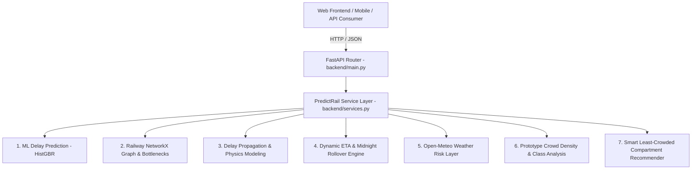

# PredictRail FastAPI Backend Integration Report

## 1. Executive Summary & Architecture Overview

The **PredictRail Backend** (`backend/`) serves as the unified REST API gateway that consolidates the entire machine learning, graph analysis, physical delay propagation, dynamic ETA, meteorological risk, and prototype crowd advisory stack into a single, high-performance, asynchronous service layer built on **FastAPI** and **Pydantic v2**.

### Subsystem Topology


---

## 2. API Endpoints Reference

| Method | Endpoint | Description | Subsystem Integrated |
|---|---|---|---|
| `GET` | `/health` | Service health, version, and project metadata | Core System |
| `GET` | `/trains` | List & search available Indian Railways train catalog | Timetable DB |
| `GET` | `/trains/{train_number}` | Complete route stop itinerary, distances, and times | Timetable DB |
| `POST` | `/predict-delay` | ML station arrival delay prediction & severity | ML Regression Pipeline |
| `POST` | `/eta` | Multi-stop Dynamic ETA with delay propagation | Dynamic ETA & Graph |
| `GET` | `/weather/{station_code}` | Real-time weather, WMO category, and risk buffer | Open-Meteo & Risk Heuristics |
| `POST` | `/crowd` | Synthetic prototype passenger counts and coach load | Prototype Crowd Estimator |
| `POST` | `/recommend-compartment` | Smart least-crowded coach recommendation & reasoning | Advisory Recommender |
| `POST` | `/predict` | **Unified Master Endpoint:** Combines all 7 subsystems | Master Intelligence |

---

## 3. Request & Response Examples

### A. Health Check (`GET /health`)
```json
{
  "status": "ok",
  "project": "PredictRail",
  "version": "1.0.0"
}
```

### B. Single-Station ML Prediction (`POST /predict-delay`)
**Request:**
```json
{
  "train_number": "12423",
  "station_code": "GHY",
  "current_delay_minutes": 15.0,
  "departure_hour": 14
}
```
**Response:**
```json
{
  "train_number": "12423",
  "station": "GHY",
  "station_name": "GUWAHATI",
  "predicted_delay_minutes": 27.4,
  "delay_severity": "Moderate Delay (15 - 60 min)",
  "model": "PredictRail delay prediction model"
}
```

### C. Station Weather & Meteorological Risk (`GET /weather/NDLS`)
**Response:**
```json
{
  "station_code": "NDLS",
  "station_name": "NEW DELHI",
  "latitude": 28.6423,
  "longitude": 77.2200,
  "temperature_c": 26.0,
  "relative_humidity_pct": 90,
  "precipitation_mm": 0.0,
  "wind_speed_kmh": 2.0,
  "visibility_m": 7220.0,
  "weather_category": "CLEAR",
  "weather_description": "Overcast",
  "weather_risk_score": 5.0,
  "weather_risk_level": "Very Low (Optimal Rail Conditions)",
  "badge_color": "green",
  "weather_delay_adjustment_min": 0.0,
  "source": "Open-Meteo",
  "is_cached": false,
  "offline_fallback": false
}
```

### D. Smart Compartment Recommendation (`POST /recommend-compartment`)
**Request:**
```json
{
  "train_number": "13009",
  "station_code": "HWH",
  "budget_filter": "NON_AC"
}
```
**Response:**
```json
{
  "train_number": "13009",
  "station_code": "HWH",
  "data_type": "SYNTHETIC_PROTOTYPE",
  "recommended_coach_or_class": "SL",
  "recommended_coach_id": "S2",
  "recommended_class_name": "Sleeper Class (SL)",
  "crowd_level": "MEDIUM",
  "occupancy_ratio": 0.542,
  "occupancy_percent": 54.2,
  "estimated_passengers": 195,
  "estimated_capacity": 360,
  "reason": "Class SL (Sleeper Class (SL)) has the lowest estimated occupancy at 54.2% (MEDIUM crowd density). Saves ~21.7% congestion compared to GEN (75.9% - MEDIUM).",
  "ranked_options": [
    {
      "coach_class": "SL",
      "class_display_name": "Sleeper Class (SL)",
      "occupancy_ratio": 0.542,
      "occupancy_percent": 54.2,
      "crowd_level": "MEDIUM",
      "total_passengers": 195,
      "total_capacity": 360,
      "is_recommended": true
    },
    {
      "coach_class": "GEN",
      "class_display_name": "General Unreserved (GEN/GS)",
      "occupancy_ratio": 0.759,
      "occupancy_percent": 75.9,
      "crowd_level": "MEDIUM",
      "total_passengers": 205,
      "total_capacity": 270,
      "is_recommended": false
    }
  ],
  "disclaimer": "PROTOTYPE DATA: Synthetic passenger density estimate for demonstration purposes only. Not live sensor or IRCTC PNR data."
}
```

### E. Unified Master Intelligence Endpoint (`POST /predict`)
Combines train timetable, ML delay prediction, dynamic multi-stop ETA, weather risk scoring, prototype crowd analysis, smart compartment recommendation, upcoming bottleneck junctions, and physical delay propagation into one response.

---

## 4. Input Validation & Error Handling

- **Pydantic v2 Type Constraints:** Non-negative constraints (`ge=0.0`) on delays, hour bounds ($0 \le \text{hour} \le 23$), and string sanitization.
- **Logical Validation:** Returns HTTP 400 Bad Request if the queried station is not part of the train's actual scheduled route.
- **Resource Not Found:** Returns HTTP 404 Not Found for non-existent train numbers.
- **Subsystem Isolation:** If an optional external service fails (e.g. Open-Meteo timeout), the service returns an offline fallback for that section without crashing the unified `/predict` payload.
- **Zero Stack Trace Leaks:** Unhandled internal server errors are caught and sanitized before reaching API clients.

---

## 5. CORS Configuration

CORS is strictly configured in `backend/config.py` to allow local development frontends:
- `http://localhost:3000` (React / Next.js)
- `http://localhost:5173` (Vite)
- `http://127.0.0.1:3000`
- `http://127.0.0.1:5173`

---

## 6. How to Run the Backend Server

```bash
# Activate virtual environment
.venv\Scripts\activate

# Launch FastAPI application with Uvicorn
python -m uvicorn backend.main:app --reload --host 0.0.0.0 --port 8000
```

Once running:
- **Interactive OpenAPI Documentation (Swagger UI):** `http://localhost:8000/docs`
- **ReDoc Documentation:** `http://localhost:8000/redoc`
- **Health Check:** `http://localhost:8000/health`
