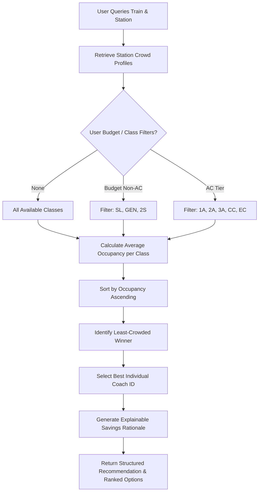

# PredictRail Prototype Crowd Estimation & Smart Compartment Recommendation Report

## 1. Executive Summary & Purpose

The **PredictRail Crowd Module** (`crowd/`) introduces **Prototype Crowd Estimation** and **Smart Compartment Recommendation** capabilities to the PredictRail architecture. In Indian Railways operations, passenger overcrowding across compartments (specifically between General Unreserved, Sleeper, and AC classes) represents a primary factor in boarding delays, platform dwell-time inflation, and passenger travel discomfort.

This module provides:
1. **Synthetic Passenger Density Estimation:** Simulates realistic compartment-level passenger counts and occupancy ratios across train stops.
2. **Transparent Operational Crowd Classification:** Classifies coach congestion into standard `LOW`, `MEDIUM`, and `HIGH` density tiers using configurable thresholds.
3. **Smart Compartment Recommendation:** Evaluates available coach options and transparently recommends the least crowded compartment with quantitative reasoning.

---

> [!IMPORTANT]
> **Synthetic Data & Academic Disclaimer:**  
> Indian Railways does not publish public real-time coach-level camera feeds, thermal occupancy sensors, or live unreserved passenger counts. All passenger volume data in this module is **SYNTHETIC PROTOTYPE DATA** generated from empirical Indian Railways rake compositions, train types, and route progression dynamics. This module is an architectural and algorithmic prototype and must **NOT** be described or marketed as live AI computer vision or real-time IoT sensor detection.

---

## 2. Synthetic Dataset Architecture & Schema

- **File Path:** `data/synthetic/crowd_data.csv`
- **Total Records:** `26,081` synthetic coach occupancy records
- **Train Coverage:** `150` representative Indian Railways trains (Rajdhani, Shatabdi, Superfast, Mail/Express, Passenger)
- **Station Coverage:** `1,556` unique railway stations across India

### Data Fields
| Field Name | Type | Description |
|---|---|---|
| `train_number` | `str` | Alphanumeric Indian Railways train identifier (e.g., `12423`, `13009`) |
| `train_name` | `str` | Full train service title (e.g., `DBRT-NDLS RAJDHANI EXP`) |
| `train_type` | `str` | Service category (`Rajdhani`, `Shatabdi`, `Superfast`, `Mail_Express`, `Passenger`) |
| `station_code` | `str` | IR station code (e.g., `NDLS`, `HWH`, `GHY`, `CNB`, `MAS`) |
| `station_name` | `str` | Station name |
| `station_sequence` | `int` | Stop sequence along the train's route |
| `coach_class` | `str` | Travel class (`1A`, `2A`, `3A`, `3E`, `SL`, `GEN`, `CC`, `EC`, `2S`) |
| `coach_id` | `str` | Physical coach identifier (e.g., `A1`, `B1`, `S1`, `GS1`, `H1`) |
| `estimated_passengers` | `int` | Simulated passenger count inside the coach |
| `estimated_capacity` | `int` | Standard nominal seating/berth capacity of the coach |
| `occupancy_ratio` | `float` | Passenger-to-capacity fraction ($\frac{\text{passengers}}{\text{capacity}}$) |
| `crowd_level` | `str` | Categorical congestion tier (`LOW`, `MEDIUM`, `HIGH`) |
| `simulation_time` | `str` | ISO 8601 simulation timestamp |
| `data_tag` | `str` | Explicit tagging constant: `SYNTHETIC_PROTOTYPE` |

---

## 3. Indian Railways Coach Class Capacities & Rake Configurations

Standard nominal coach capacities reflect official Indian Railways rolling stock specifications:

```
+---------------+-----------------------------+-------------------+-----------------------------+
| Coach Class   | Full Class Name             | Nominal Capacity  | Typical Occupancy Band      |
+---------------+-----------------------------+-------------------+-----------------------------+
| 1A            | AC First Class              | 24 berths         | 30% - 70% (Comfortable)     |
| 2A            | AC 2-Tier                   | 54 berths         | 45% - 85% (Moderate-High)   |
| 3A            | AC 3-Tier                   | 72 berths         | 65% - 95% (High Demand)     |
| 3E            | AC 3 Economy                | 83 berths         | 70% - 98% (High Density)    |
| SL            | Sleeper Class               | 72 berths         | 75% - 110% (Peak Loaded)    |
| GEN / GS      | General Unreserved          | 90 seats          | 85% - 140% (Overcrowded)    |
| CC            | AC Chair Car                | 78 seats          | 55% - 90% (Day Corridor)    |
| EC            | Executive Chair Car         | 56 seats          | 35% - 70% (Premium Day)     |
| 2S            | Second Sitting              | 108 seats         | 60% - 95% (Day Intercity)   |
+---------------+-----------------------------+-------------------+-----------------------------+
```

---

## 4. Crowd Calculation Formulas & Configurable Thresholds

### Occupancy Calculation Formula
$$\text{Occupancy Ratio} = \frac{\text{Estimated Passengers}}{\text{Nominal Capacity}}$$

$$\text{Occupancy Percentage} = \text{Occupancy Ratio} \times 100\%$$

### Centrally Configured Classification Thresholds
Located centrally in `crowd/crowd_detector.py` under `CROWD_THRESHOLDS`:

$$\text{Crowd Level} = \begin{cases} 
\text{LOW}, & \text{if } \text{Occupancy Ratio} \le 0.50 \\
\text{MEDIUM}, & \text{if } 0.50 < \text{Occupancy Ratio} \le 0.80 \\
\text{HIGH}, & \text{if } \text{Occupancy Ratio} > 0.80 \text{ (including overcapacity } > 1.00\text{)}
\end{cases}$$

### Operational Interpretation
- **`LOW` ($\le 50\%$):** Plentiful empty seats/berths; zero boarding bottlenecks; comfortable luggage storage.
- **`MEDIUM` ($51\% - 80\%$):** Normal full load; moderate aisle movement; standard platform dwell.
- **`HIGH` ($> 80\%$):** Heavy passenger density; unreserved standing passengers; increased halt dwell time.

---

## 5. Smart Compartment Recommendation Algorithm

The recommendation engine (`crowd/recommendation.py`) evaluates all available compartments for a selected train stop and determines the optimal travel class for passenger comfort.

### Algorithmic Workflow
1. **Fetch Compartment Profile:** Queries `get_coach_crowd_profile()` for the train and station stop.
2. **Apply User Filters:** Respects optional budget criteria:
   - `budget_filter="NON_AC"`: Evaluates only `SL`, `GEN`, `2S`.
   - `budget_filter="AC"`: Evaluates only `1A`, `2A`, `3A`, `3E`, `CC`, `EC`.
   - `preferred_classes`: Specific subset of classes requested by user.
3. **Objective Optimization:** Sorts candidate classes in ascending order by average occupancy ratio ($\min \text{Occupancy Ratio}$).
4. **Specific Coach Selection:** Selects the specific physical coach (e.g. `A1`, `B2`, `S3`) with the absolute lowest occupancy in the winning class.
5. **Explainable Rationale Generation:** Computes the congestion delta ($\Delta \text{occupancy}$) saved compared to the most crowded alternative class and formats a human-readable justification.



---

## 6. Example Prototype Outputs

### Example 1: Train 12423 (Dibrugarh – New Delhi Rajdhani Express) at Guwahati (`GHY`)
```
Overall Train Load: 79.7% (MEDIUM) | Est. Pax: 607 / 762

Coach/Class Breakdown:
  * 2A   [#########-----------] LOW    ->  48.1% (26/54 pax)  <-- RECOMMENDED
  * 1A   [##########----------] LOW    ->  50.0% (12/24 pax) 
  * 3A   [###############-----] MEDIUM ->  75.9% (164/216 pax) 
  * SL   [###############-----] MEDIUM ->  76.7% (221/288 pax) 
  * GEN  [####################] HIGH   -> 102.2% (184/180 pax) 

Recommendation: Class 2A (Coach A1)
Reason: Class 2A (AC 2-Tier (2A)) has the lowest estimated occupancy at 48.1% (LOW crowd density). Saves ~54.1% congestion compared to GEN (102.2% - HIGH).
```

### Example 2: Train 13009 (Doon Express) at Howrah (`HWH`) with Budget Filter (`NON_AC`)
```
Filter: NON_AC (Budget Non-AC)
Overall Train Load: 59.4% (MEDIUM) | Est. Pax: 492 / 828

Coach/Class Breakdown:
  * SL   [##########----------] MEDIUM ->  54.2% (195/360 pax) <-- RECOMMENDED
  * GEN  [###############-----] MEDIUM ->  75.9% (205/270 pax) 

Recommendation: Class SL (Coach S2)
Reason: Class SL (Sleeper Class (SL)) has the lowest estimated occupancy at 54.2% (MEDIUM crowd density). Saves ~21.7% congestion compared to GEN (75.9% - MEDIUM).
```

---

## 7. Assumptions & Technical Limitations

1. **Synthetic Nature:** Passenger counts are generated via statistical distributions rather than live sensor hardware or live IRCTC databases.
2. **Fixed Capacity Norms:** Dynamic extra coaches (e.g. holiday special rakes) are approximated using standard Indian Railways rake composition templates.
3. **No Target Leakage:** Crowd estimation is maintained as an advisory layer and does not artificially feed into the Step 3 delay prediction model or alter historical delay features.
